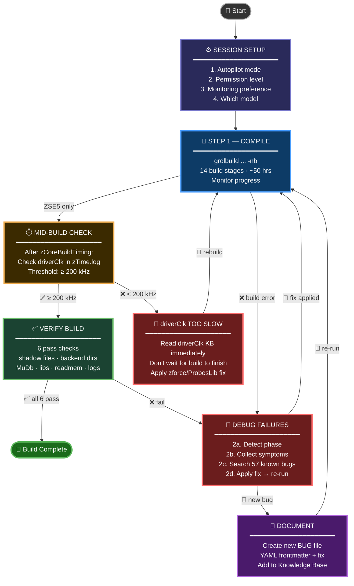
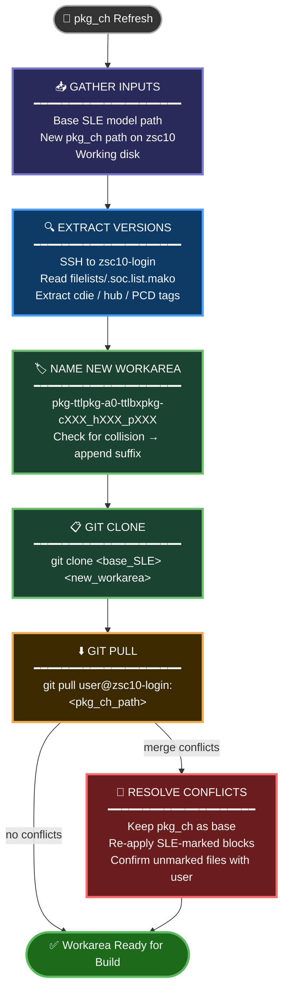

<div align="center">

# 🤖  SLE Emulation Agent

**An AI-powered agent that compiles ZeBu ZSE5 and FPGA emulation models, monitors build progress, debugs build failures, and applies fixes — for TTLbx and TTLhm.**

[](https://github.com/tbaziza/emulation_agent)
[](05_knowledge_and_debugging/known_bugs_and_fixes/)
[]()

</div>

---

## 📦 First-Time Setup

> **One-time install — do this once per environment.**

### Step 1: Clone the Knowledge Base

```bash
git clone https://github.com/tbaziza/emulation_agent.git
```

### Step 2: Run the init script

```bash
bash emulation_agent/copilot_cli_agent/init_agent.sh
```

The script will:
1. **Ask for your working disk path** — enter the path to your large project disk (e.g. `/nfs/site/disks/issp_ttl_emu_compile_001`). This is NOT the model workarea, just your general working disk.
2. **Move your Copilot agents** to the working disk (avoids NFS home quota issues) and create a symlink back at `~/.copilot/agents`
3. **Install the `sle_emulation_agent`** into the agents directory with `KB_ROOT` pre-configured

### Step 3: Done — load the agent

Once the script prints **✅ Setup Complete!**, the agent is ready. Launch Copilot CLI and select it:

```bash
/p/hdk/cad/copilot/latest/copilot
/agent sle_emulation_agent
```

> 💡 **To update later**, `git pull` inside `emulation_agent/` and re-run `init_agent.sh` with the same working disk path.

---

## ⚡ Quick Start (Daily Use)

```bash
# 1. Go to your model workarea
cd <your_model_workarea>

# 2. Set up the model environment
cth_psetup <your_stepping>

# 3. Launch Copilot CLI
/p/hdk/cad/copilot/latest/copilot

# 4. Select the agent
/agent sle_emulation_agent

# 5. Start working
You: compile the model
```

> ⚠️ **You must run `cth_psetup` before launching Copilot CLI.** The agent relies on the environment it configures.

---

## 🎯 Supported Models

| Model | Type | Platform | Build Command |
|-------|------|----------|--------------|
| **Converged TTLbx** | ZSE5 + FPGA | ttlbx | `grdlbuild ttlbx_n2p:emu:sle:pkg_chpr_p2e4_816_fast_zse ttlbx_n2p:emu:sle:pkg_chpr_cfgr_p2e0_816_fast_zse ttlbx_n2p:emu:fpga:pkg_chpr_cfgr_p2e0_816_fast_vcs -nb` |
| `pkg_chpr_p2e4_816_fast` | ZSE5 | ttlbx | `grdlbuild ttlbx_n2p:emu:sle:pkg_chpr_p2e4_816_fast_zse -nb` |
| `pkg_chpr_cfgr_p2e0_816_fast` | ZSE5 | ttlbx | `grdlbuild ttlbx_n2p:emu:sle:pkg_chpr_cfgr_p2e0_816_fast_zse -nb` |
| `pkg_chpr_cfgr_p2e0_816_fast` | FPGA slimsim | ttlbx | `grdlbuild ttlbx_n2p:emu:fpga:pkg_chpr_cfgr_p2e0_816_fast_vcs -nb` |
| `pkg_chpr_p2e4_816_fast` | ZSE5 | ttlhm | `grdlbuild ttlhm_n2p:emu:sle:pkg_chpr_p2e4_816_fast_zse -nb` |

> **Converged TTLbx** launches all 3 TTLbx targets in a single `grdlbuild` call, sharing common dependency stages. TTLhm has only one target — no converged option.

---

## 🔄 Typical Workflow

The agent follows this loop until the model compiles successfully:



### Workflow Details

**Session Setup** — Every new session, the agent asks:
1. Switch to autopilot mode (`/model` → autopilot)
2. Permission level: Full auto / Build only / Read-only
3. Monitoring preference: **Manual** *(default — periodic log checks in chat)* or Background script *(known reliability issues)*
4. WORKAREA path (always asked — never assumed)
5. Which model to build

**Step 1: Compile** — Launches `grdlbuild` and monitors progress through 14 stages (~50 hrs for ZSE5). Reads both monitoring KB files before starting.

**Mid-Build driverClk Check (ZSE5 only)** — As soon as `zCoreBuildTiming` completes, checks `zTime.log` immediately. Does NOT wait for the full build to finish. If driverClk < 200 kHz, reads the driverClk KB and alerts you — the build result would be unusable.

> ⚠️ **Non-deterministic risk**: The same workspace can produce wildly different driverClk across builds (e.g., 612 kHz vs 10 kHz from identical source). A single good result does NOT mean the issue is resolved.

**Verify** — Runs 6 pass checks after build completes. All must pass.

**Debug** — If anything fails, detects the phase (BUILD / ANALYZE/ELAB / SYNTHESIS), collects symptoms, searches 57 known bug files, and applies the best-matched fix before re-running.

---

## 🔄 pkg_ch IP Refresh Workflow

Use this when a new `pkg_ch` model release is available on zsc10 and you need to create a new SLE workarea based on it.



### Refresh Workflow Details

**Inputs required**:
- Base SLE model path (known-good, local disk) — e.g., `/nfs/site/disks/issp_ttl_emu_compile_001/pkg-ttlpkg-a0-ttlbxpkg-c15a_h15b_p13a.1`
- New pkg_ch model path on zsc10 — e.g., `/p/cth/rtl/models/ddgcth/ttl/pkg_emu/pkg-ttlpkg-a0-ttlbxpkg-cdie_ww17f_hub_ww17e`
- Working disk for the new clone

**Version extraction** — The agent SSHes to `zsc10-login.zsc10.intel.com` and reads `filelists/.soc.list.mako` in the new pkg_ch model. It extracts version tags from the `26wwXXX` workweek strings in the cdie, hub, and `pcd_cfgr` path entries (e.g., `26ww17f` → `c17f`, `26ww17e` → `h17e`, `26ww13a` → `p13a`).

**Naming** — New workarea is named `<prefix>-c<cdie>_h<hub>_p<pcd>`. If that directory already exists on the working disk, a `.2`, `.3` suffix is appended.

**Merge conflict resolution** — SLE-specific content is identified by `// SLE Change`, `// SLE Addition`, `## SLE Change`, or `## SLE Addition` markers. Resolution rule: use pkg_ch as the base, re-apply all SLE-marked blocks. For comment-free file types (JSON, `.mako`, CSV), the agent diffs both sides and asks the user before discarding any SLE content.

---

## 🎯 What Can I Ask?

### 🔨 Compilation
| Prompt | What it does |
|--------|-------------|
| `compile the model` | Start a fresh grdlbuild |
| `resume the build` | Continue a build with `-id` |
| `check if compilation passed` | Run the 6 pass checks |
| `check driverClk` | Check zTime.log for driverClk speed |
| `monitor the build` | Check current progress in grdlbuild.log |

### 🐛 Debugging
| Prompt | What it does |
|--------|-------------|
| `debug this build failure` | Full triage: phase detection → symptoms → bug matching |
| `search known bugs for <error text>` | Search the 57 BUG files |
| `what known bugs match <symptom>?` | Find matching bugs by keyword |
| `why is driverClk slow?` | Read driverClk KB and analyze zTime.log |

### 🔧 RTL Changes & Integration
| Prompt | What it does |
|--------|-------------|
| `create a new rtlchange` | Walk through replacement + .ref + HSDs.toml + config |
| `refresh rtlchanges` | Fix stale .ref files or missing HSDs.toml entries |
| `integrate new PCD BKC` | rsync from FM + apply SLE delta |
| `regenerate ttlpcdhpkg rtlchange` | PCD port list changed → rebuild wrapper rtlchange |

### 🔄 pkg_ch IP Refresh
| Prompt | What it does |
|--------|-------------|
| `prepare a new workarea for pkg_ch refresh` | Full flow: clone base SLE, pull new pkg_ch, resolve conflicts |
| `what cdie/hub/pcd version is in this pkg_ch model?` | Read `.soc.list.mako` on zsc10 and extract version tags |

### 📋 Status & Info
| Prompt | What it does |
|--------|-------------|
| `what build stage are we on?` | Check .shadow progress |
| `show the build stages` | List all 14 stages |
| `show safety rules` | Review the red lines |

---

## 🛡️ Safety Red Lines

| Rule | Detail |
|------|--------|
| 🚫 No source file deletion | Always backup before any destructive operation |
| 🚫 No subip/soc/handoff edits | Requires explicit user approval |
| 🚫 No login-node compilation | Always use compute resources |
| 🚫 No GK branch pushes | Requires explicit user approval |
| ✅ Always asks before git commit | Never auto-commits |
| ✅ Never guesses shell commands | Intel infra is non-standard — asks the user |

---

## 🎯 Bug Match Confidence Score

When a failure occurs, the agent searches **57 known bugs** and scores each match:

| Signal | Points |
|--------|--------|
| Exact tag match (e.g., `rpath`, `dlopen`) | **+50 pts** |
| Category match (e.g., `library`, `build-config`) | **+30 pts** |
| Critical symptom found | **+10 pts** |
| Phase match | **+5 pts** |
| Phase mismatch | **×0.5 penalty** |

| Score | Level | Action |
|-------|-------|--------|
| ≥ 200 | 🟢 **VERY HIGH** | Apply fix directly |
| 50–99 | 🟡 **HIGH** | Apply fix, verify result |
| 15–29 | 🟠 **MEDIUM** | Review BUG file before acting |
| < 15  | 🔴 **LOW** | Likely new/unknown — escalate to user |

---

## 📂 Knowledge Base Structure

```
📁 emulation_agent/
├── 📄 00_index.md                          ← Start here — routing table + file tree
├── 📁 01_agent_core/                       ← Identity, safety rules, AI guidelines
├── 📁 02_execution/                        ← Build commands, environment setup
├── 📁 03_testing_and_validation/           ← Quality gates, emulator setup
├── 📁 04_monitoring/                       ← Metrics, alert thresholds
├── 📁 05_knowledge_and_debugging/          ← Debug workflow, symptom rules
│   ├── 📁 known_bugs_and_fixes/            ← 57 bug files (BUG-001 to BUG-057)
│   ├── 🔧 run_phase_detection_nvlax.sh     ← Automated bug matcher
│   └── 📄 symptom_rules.txt                ← Keyword expansion rules
├── 📁 06_skills/                           ← Procedure KB files (read before acting)
│   ├── sle-build-grdlbuild-monitor.md      ← Build monitoring procedure
│   ├── sle-build-iterative-build-monitor-fix.md ← End-to-end build-fix cycle
│   ├── sle-build-zebu-driverclock-debug.md ← driverClk analysis + fixes
│   ├── sle-build-pkgch-refresh.md          ← pkg_ch IP refresh: clone + pull + conflict resolution
│   ├── sle-build-rtlchanges-create.md      ← Create new rtlchange
│   ├── sle-build-rtlchanges-refresh.md     ← Refresh stale rtlchanges
│   ├── sle-build-pcd-bkc-integration.md    ← PCD BKC release integration
│   ├── sle-build-pcd-pkgpinlist-rtlchange-generation.md ← PCD wrapper rtlchange
│   ├── sle-build-fpga-elab-missing-cell-fix.md ← FPGA CFCILFBI fix
│   ├── sle-build-fpga-rtlchanges-postcheck-fix.md ← FPGA postcheck fix
│   ├── sle-build-new-target-analysis-opts.md ← New build target analysis opts
│   └── sle-build-dfx-target-enablement.md  ← DFX target enablement
└── 📁 copilot_cli_agent/                   ← Agent instruction file + init script
```

---

## 🔍 Verify Setup

Inside Copilot CLI, run these commands:

```
/agent              → should show sle_emulation_agent
/instructions       → should show loaded instruction file
/env                → should show KB_ROOT path
```

---

<div align="center">

**SLE Emulation · Intel TTL**

</div>
